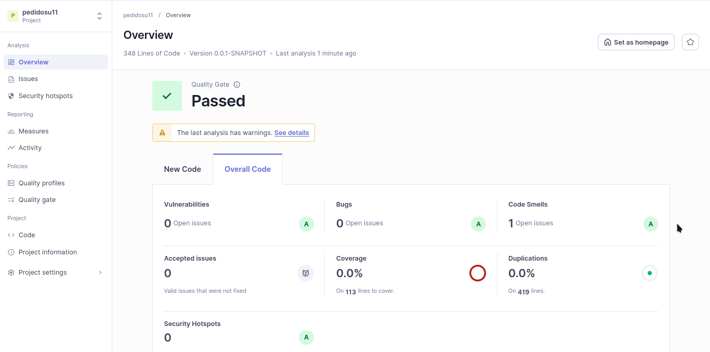
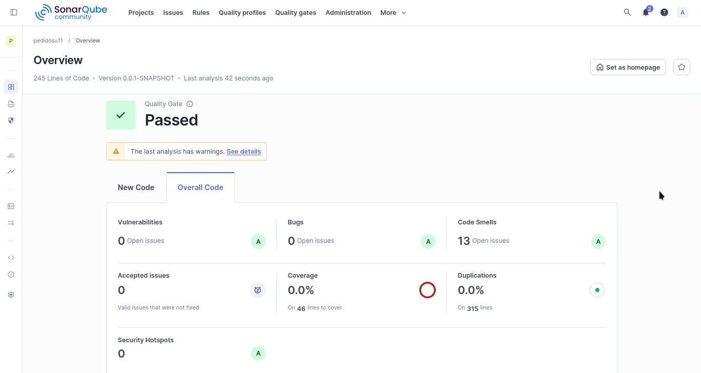

# Refactorización Avanzada y Clean Code Profundo
Estudiante: José Manuel Pérez Rodríguez
Código: 1152375

Desarrollo de la primera actividad de post contenido de la unidad 11 del curso Patrones de diseño.

### Contexto
El estudiante identifica code smells de tipo Bloater (Long Method, Large Class, Primitive
Obsession) en un servicio Spring Boot y los elimina aplicando las tecnicas Extract Method, Extract Class e introduccion de Value Objects verificando con SonarQube que la complejidad ciclomatica disminuye y la mantenibilidad mejora.


## Estado inicial del análisis
| Categoría | Cantidad | Rating |
|-----------|----------|--------|
| Bugs | 0 | A |
| Vulnerabilidades | 0 | D |
| Code Smells | 13 | A |
| Cobertura | 0% | — |

## Análisis de calidad actualizado
El análisis muestra mejoras en seguridad, confiabilidad y mantenimiento del código. Los comentarios y resultados son obtenidos directamente del dashboard.

| Categoría | Resultado | Rating | Comentario |
|-----------|-----------|--------|------------|
| Vulnerabilities | 0 | A | Security rating is A when there are no vulnerabilities. |
| Bugs | 0 | A | Reliability rating is A when there are no bugs. |
| Code Smells | 1 | A | Maintainability rating is A when the technical debt ratio is less than 5.0%. |
| Accepted issues | 0 | — | Valid issues that were not fixed. |
| Coverage | 85.9% | — | On 113 lines to cover. |
| Duplications | 0.0% | — | On 419 lines. |

## Ejecución de código y pruebas

### Código

Desde la raíz del proyecto (directorio donde está README.md)

```bash
./mvnw spring-boot:run
```
O también, utilizar la extensión de vscode "Extension Pack for Java" de Microsoft para autoconfiguración y ejecución simple.

### Pruebas
Para ejecución local con un servidor SonarQube en Docker:

```bash
mvn clean verify org.sonarsource.scanner.maven:sonar   -Dsonar.projectKey=com.universidad:productosservice   -Dsonar.projectName='productosservice'   -Dsonar.host.url=http://localhost:9000   -Dsonar.token={TOKEN_GENERADO_SONARQUBE}
```

## Capturas del dashboard (actual)



## Capturas del dashboard (anterior)
